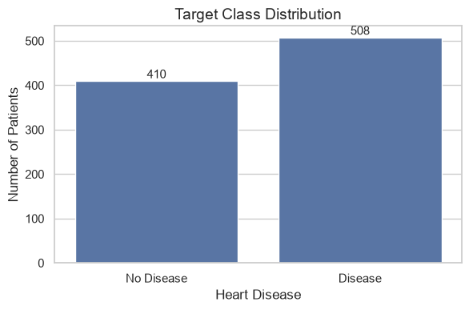
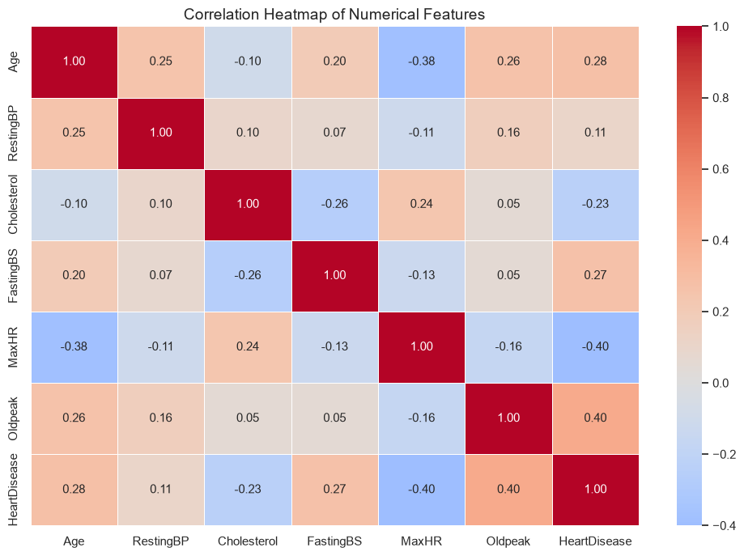
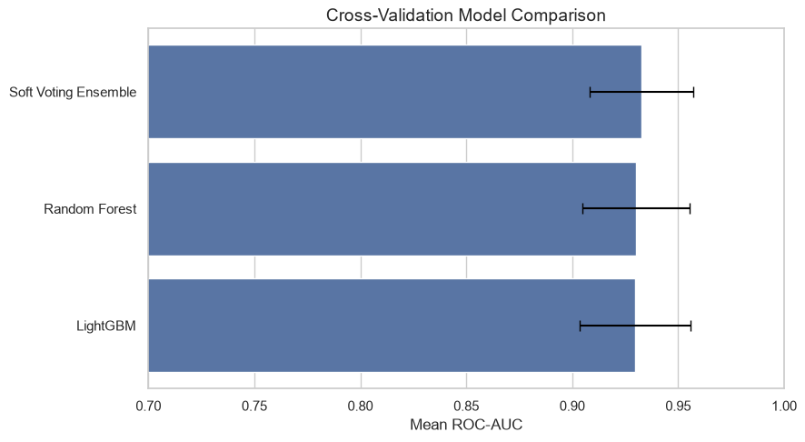
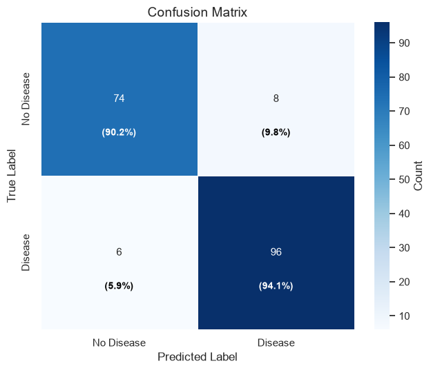
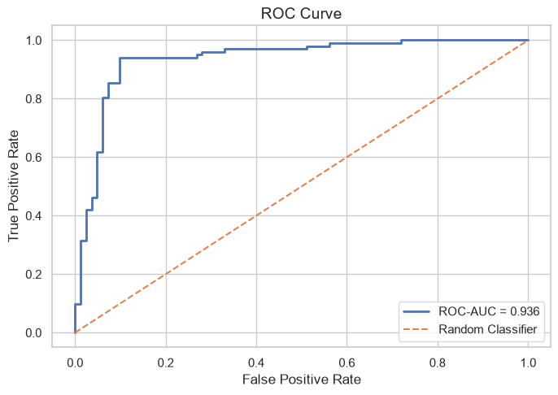
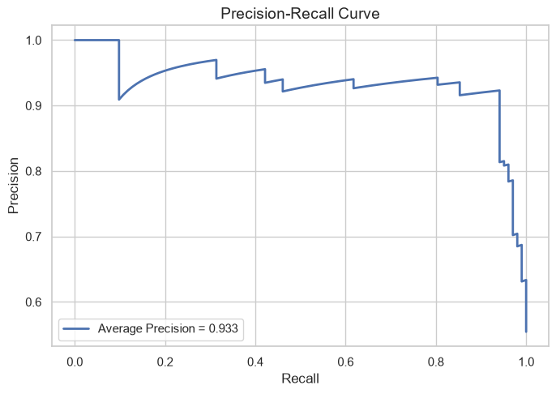
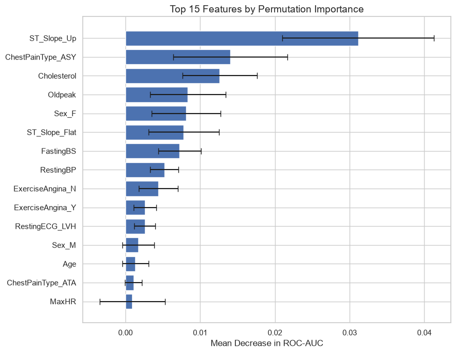

# ❤️ Heart Disease Prediction with Machine Learning


A clean, reproducible machine-learning notebook for predicting **heart disease risk** using demographic, clinical, and exercise-test features.

The project combines exploratory data analysis, preprocessing, model comparison, ensemble learning, final evaluation, permutation importance, and SHAP explainability in a publication-ready workflow.

> **Note:** This project is intended for educational and research purposes only. It is not a clinical diagnostic system.

---

## 📌 Project Overview

The goal of this project is to predict the target variable `HeartDisease`:

- `0` → No heart disease  
- `1` → Heart disease  

The workflow is designed to answer three main questions:

1. Which clinical and exercise-test features are most associated with heart disease?
2. Which machine-learning model performs best on this dataset?
3. How can the final model predictions be explained using interpretable ML techniques?

---

## 📊 Dataset Features

The dataset contains patient-level features such as:

| Feature | Description |
|---|---|
| `Age` | Patient age |
| `Sex` | Biological sex |
| `ChestPainType` | Type of chest pain |
| `RestingBP` | Resting blood pressure |
| `Cholesterol` | Serum cholesterol |
| `FastingBS` | Fasting blood sugar |
| `RestingECG` | Resting electrocardiogram result |
| `MaxHR` | Maximum heart rate achieved |
| `ExerciseAngina` | Exercise-induced angina |
| `Oldpeak` | ST depression induced by exercise |
| `ST_Slope` | Slope of the peak exercise ST segment |
| `HeartDisease` | Target variable |

---

## 🧠 Machine Learning Workflow

The notebook includes:

- Data loading and quality checks
- Exploratory data analysis
- One-hot encoding for categorical variables
- Train/test split with stratification
- Cross-validation model comparison
- Final ensemble model training
- Test-set evaluation
- Confusion matrix
- ROC curve and Precision-Recall curve
- Permutation feature importance
- SHAP explainability using the LightGBM component

---

## 🏆 Model Performance

The final model achieved the following test-set results:

| Metric | Score |
|---|---:|
| Accuracy | **0.9239** |
| ROC-AUC | **0.9359** |
| Average Precision | **0.9334** |

Cross-validation comparison:

| Model | Mean ROC-AUC | Std ROC-AUC |
|---|---:|---:|
| Soft Voting Ensemble | **0.9327** | 0.0245 |
| Random Forest | 0.9302 | 0.0254 |
| LightGBM | 0.9298 | 0.0261 |

---

## 📈 Visual Results

### Target Class Distribution



### Correlation Heatmap



### Cross-Validation Model Comparison



### Confusion Matrix



### ROC Curve



### Precision-Recall Curve



### Permutation Feature Importance



---

## 🔍 Explainability

The notebook includes two complementary interpretation methods:

### 1. Permutation Feature Importance

Permutation importance measures how much the model performance decreases when each feature is randomly shuffled.

The strongest predictive features include:

- `ST_Slope_Up`
- `ChestPainType_ASY`
- `Cholesterol`
- `Oldpeak`
- `Sex_F`
- `ST_Slope_Flat`
- `FastingBS`

### 2. SHAP Explainability

SHAP is applied to the **LightGBM component** of the ensemble. This keeps the interpretation focused and avoids redundant plots while still explaining the main tree-based decision patterns.

The SHAP section includes:

- Global SHAP bar plot
- Beeswarm plot
- Waterfall plot for an individual patient
- Dependence plots for the most important features

---

## 📁 Repository Structure

```text
.
├── heart_attack_publication_ready_fixed_shap_final.ipynb
├── heart.csv
├── README.md
└── assets/
    ├── target_distribution.png
    ├── correlation_heatmap.png
    ├── model_comparison_cv.png
    ├── confusion_matrix.png
    ├── roc_curve.png
    ├── precision_recall_curve.png
    └── permutation_importance.png
```

---

## ⚙️ Installation

Install the required Python libraries:

```bash
pip install numpy pandas matplotlib seaborn scikit-learn lightgbm shap
```

If you use Jupyter Notebook:

```bash
pip install notebook
```

---

## ▶️ How to Run

1. Clone the repository:

```bash
git clone https://github.com/your-username/heart-disease-prediction.git
cd heart-disease-prediction
```

2. Place the dataset file in the project root:

```text
heart.csv
```

3. Open the notebook:

```bash
jupyter notebook heart_attack_publication_ready_fixed_shap_final.ipynb
```

4. Run all cells from top to bottom.

---

## 🧪 Models Used

The main modeling pipeline compares and/or uses:

- **LightGBM Classifier**
- **Random Forest Classifier**
- **Soft Voting Ensemble**

The final ensemble combines the strengths of gradient boosting and bagging-based tree models.

---

## 📌 Key Findings

- The ensemble model achieved strong test performance with high ROC-AUC and Average Precision.
- Exercise-related features such as `ST_Slope` and `Oldpeak` were highly influential.
- Chest pain type, especially asymptomatic chest pain, was among the strongest predictors.
- SHAP and permutation importance provided consistent interpretability support for the final model.

---

## 🚀 Future Improvements

Possible future extensions:

- Hyperparameter optimization with Optuna or RandomizedSearchCV
- Probability calibration
- External validation on another dataset
- Model deployment using Streamlit or FastAPI
- Comparison with logistic regression for a more interpretable baseline

---

## 🛠️ Tech Stack

- Python
- pandas
- NumPy
- Matplotlib
- Seaborn
- scikit-learn
- LightGBM
- SHAP
- Jupyter Notebook

---

## 📜 License

This project can be released under the MIT License.

---

## ⭐ Repository Summary

This project demonstrates a complete machine-learning workflow for heart disease prediction, combining strong predictive performance with clinically meaningful explainability.
